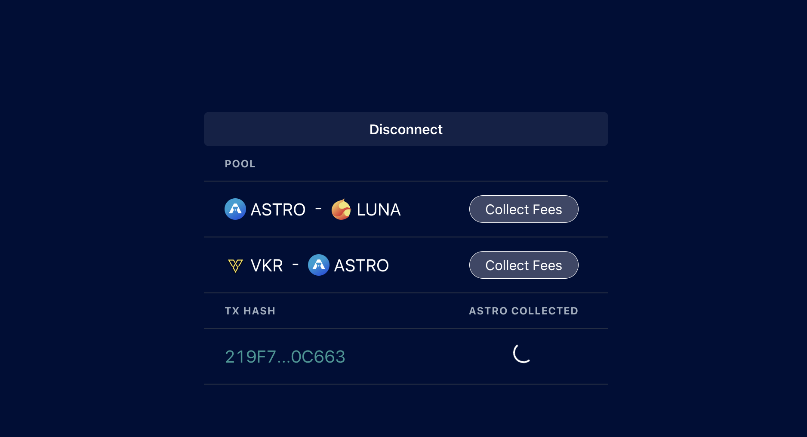

This project contains the code for a webapp that allows users to trigger the fees collection on the [Astroport DEX](https://app.astroport.fi/swap).

The project is inspired by the [tutorial from Astroport](https://astroport.medium.com/tutorial-how-to-collect-fees-from-the-astroport-maker-contract-using-terra-js-785d548dad36) on how to interact with the Maker contract to collect fees.

The app is live [here](https://astro-fees-collector.onrender.com/)

This project was bootstrapped with [Create React App](https://github.com/facebook/create-react-app).
